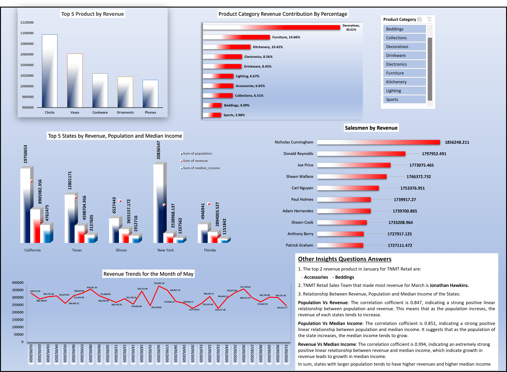
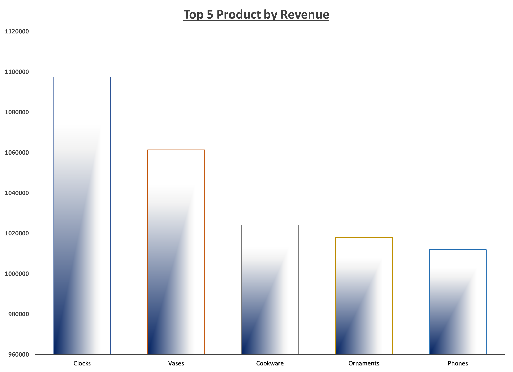
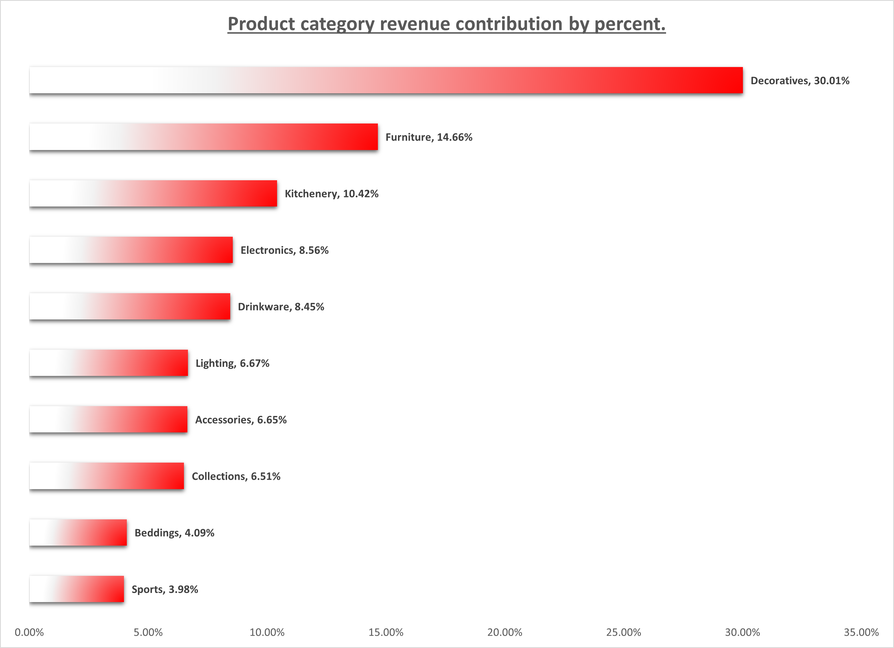
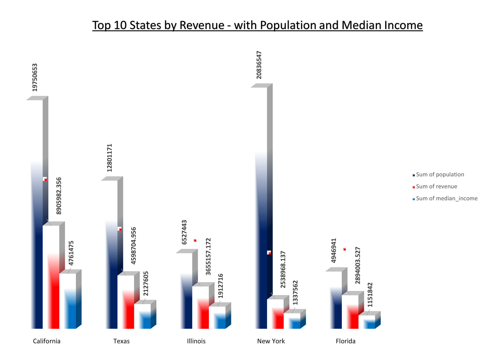
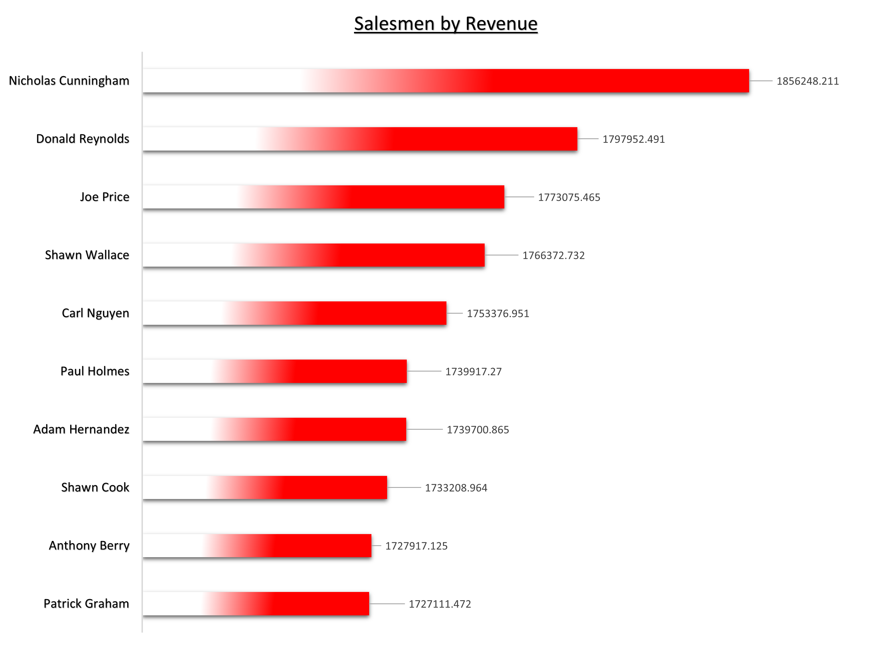
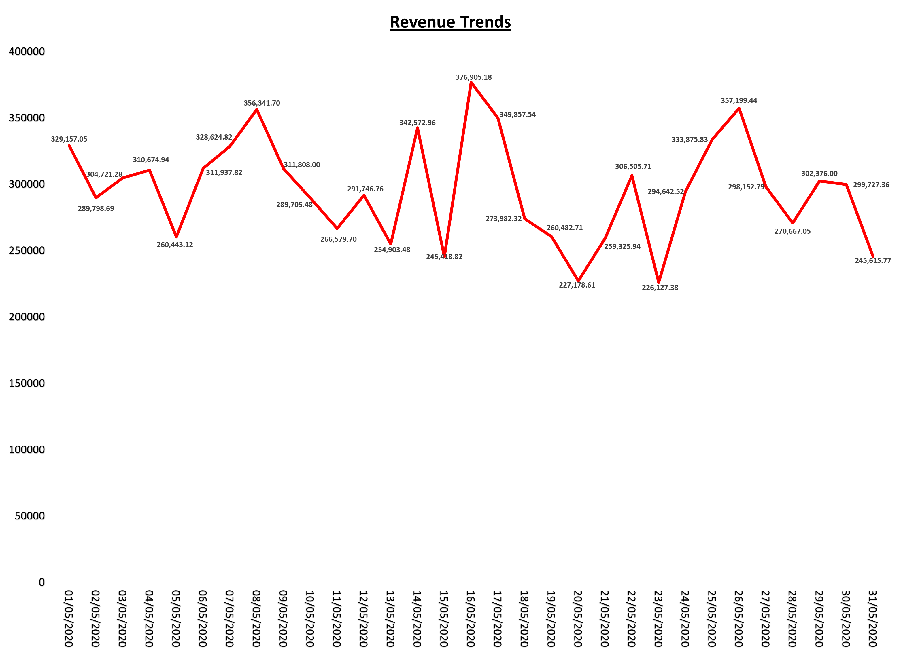

# TNMT Retail Sales Analysis Report

## Dashboard Interface and Navigation
Dashboard User Interface and Navigation portfolio
- The dashboard represents TNMT portfolio project.
- One slicer is been created to use for all charts and is clickable for easy navigation.
- Other insighgts dervied from analysis is shown using the Text-Box.

## Introduction
This is a Microsoft Excel Project on Sales Analysis for **TNMT Retail**. 
The Project analyze and derive insights to answer the business set questions. 
This assists the organisation to make better data driven decisions for their business growth.

## Problem Statement
- Calculate the (i) Revenue (ii) Profit table for every order.
- Make reports for:
  1. Products by revenue.
  2. Revenue contributions by percentage of the product category.
  3. States by revenue, showing their population and median income.
  4. Sales team by revenue.
  5. Revenue trends.

## Data sourcing:
TNMT through Utiva learning Platform.

## Data Transformation
- Two new tables column for revenue and profit were created.
- Analysis was done through data modeling using Power pivot to connect 4 tables together: sales_table, sales_team, products, store_location.
- Analysis to create reports and charts was done using Pivot table to answer business set questions.
- MS Excel toolkit (Data Analysis) was use to calculate the correlation coefficient between population, revenue and median income.

## Analysis Outcome:

### Top 5 Products by Revenue
- _**Clocks**_ have the highest form of revenue as a product for TNMT Retail with close to $1.1million revenue made so far.
- Other high-revenue products include vases, cookware, ornaments, and phones.

### Product Category Revenue Contribution by Percentage
- Product Category _**Decoratives**_ with 30.01% represent the highest revenue product by category. The product category “Decoratives” has products such as vases, ornaments, frames, rugs, outdoor decorations, etc as products with top 5 sales within it.
- The least product category by percentage is _**Sports**_ with 3.98% revenue.

### Top 10 States by Revenue, Population and Median Income
- According to Correlation coefficient insights obtained from the analysis of the dataset, states with larger population tends to have higher revenue and higher median income.
- The below chart reveals that out of the Top 5 states, _**California**_ (State) with the second highest population 19750653, ranks the highest in revenue and median income. This is followed by Texas and Illinois.

However, _**New York**_ with the highest population ranks 4 out of the top 5 states. A review of the New York outlier shows that out of the total population of New York in 2021, ages 45 – 85 above (43.5%) fall under the category of the population with less or no work history (retired) which affects the state revenue income.

### Salesmen by Revenue
Salesmen by revenue report shows _**Nicholas Cunnigham**_ as the sales man with highest revenue generated for TNMT.
The salesmen with the least revenue is _**Patrick Graham**_.

### Revenue Trends for the month of May
- The revenue trends for the month of May showed 16th May, 2020 with 376,905 as the day with the highest revenue throughout the month.

## Skills Demonstrated
- Data analysis
- Data visualisation
- Data modeling with Power pivot
- Filters
- Slicers etc

Thank you for your time.🤝
Seyi Olasupo. 
